# 🎵 MyMusic - Your Ultimate Music Streaming Platform!

       

## **🚀 Overview**

**MyMusic** is a **modern music streaming web platform** designed to provide a seamless listening experience. Built with **React, TypeScript, and Spotify APIs**, it offers a **smooth UI, real-time playback, and personalized music recommendations**.

MyMusic replicates all the core features of **Spotify Web**, along with its own **landing page and mobile-first responsive design**.

## 📌 Live Preview

👉 **[View Live Website](https://mymusic-1144.web.app)** (beta-release)

👉 **Note :-** 
|  |
|-------------|
| We are excited to introduce the beta release of our music web application! Currently, access is limited to a select group of users for testing and feedback. If you would like to request access, please send an email to vipulsuthar1144@gmail.com. I will review your request and provide further details. I appreciate your interest and look forward to your valuable feedback. |


## **🌟 Features**

✅ **Spotify Authentication** – Secure login via **Spotify OAuth**  
✅ **Stream Millions of Songs** – Powered by **Spotify API**  
✅ **Personalized Playlists & Recommendations** – Based on user preferences  
✅ **Modern UI & Animations** – Styled using **MUI, Tailwind CSS & Framer Motion**  
✅ **Fully Responsive** – Optimized for **mobile & desktop**  
✅ **Progressive Web App (PWA)** – Installable on devices for a native-like experience  
✅ **SEO Optimized** – Improved search rankings for better visibility

## 🛠️ Tech Stack

- **React (Vite) ⚛️** – Fast & optimized frontend framework
- **TypeScript 🟦** – Type-safe development experience
- **MUI & Tailwind CSS 🎨** – Modern, flexible styling
- **Framer Motion 🎞️** – Smooth animations & transitions
- **Redux Thunk 🔄** – Efficient state management
- **Axios 📡** – Handling API requests efficiently
- **Spotify API 🎵** – Fetching music data & streaming
- **Firebase 🔥** – Deployment & hosting
- **PWA** – Installable app with offline capabilities

## 📸 Screenshots

### 1. Landing Page

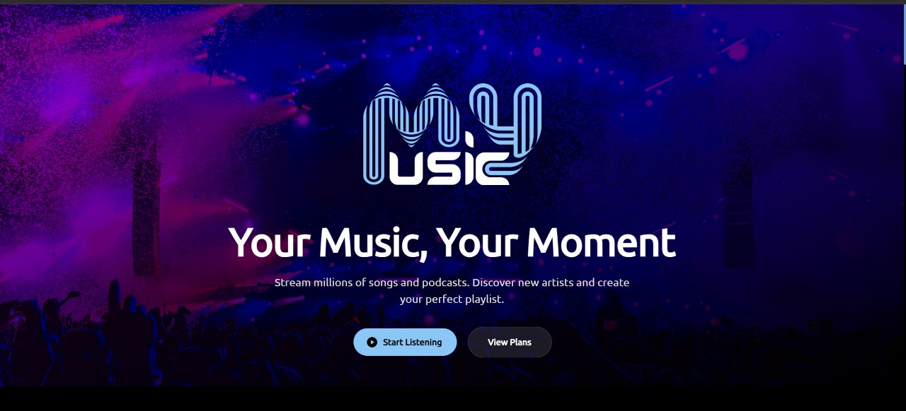
<br>

### 2. Home Screen

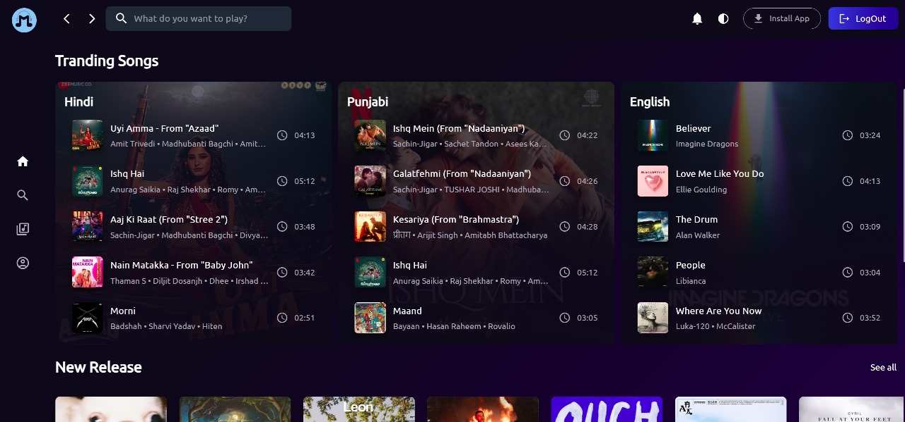
<br>

### 3. Dragable Track Player

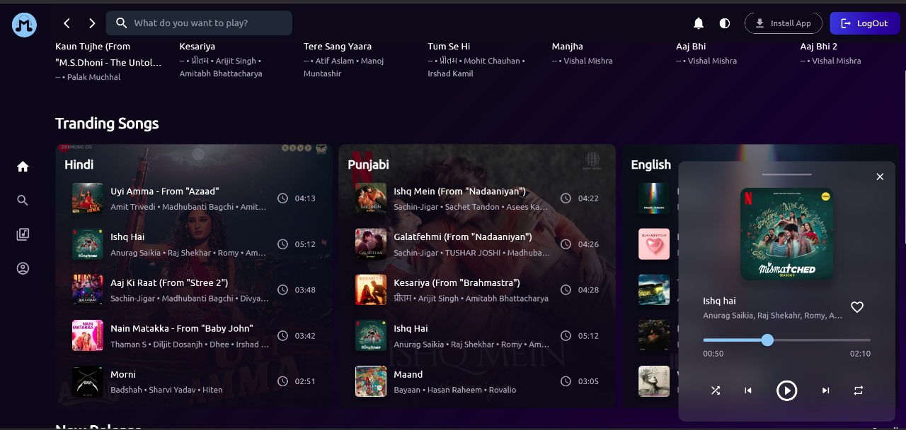
<br>

### 4. Browse Categories

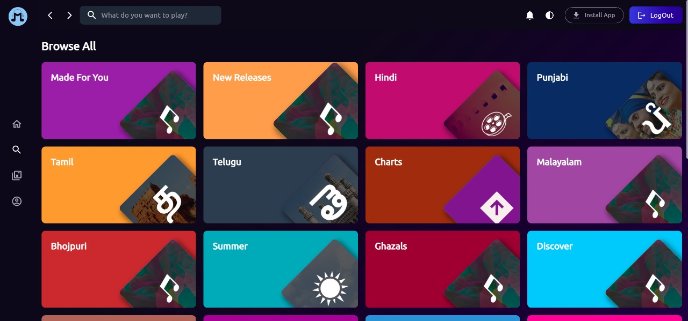
<br>

### 5. Search Results

 
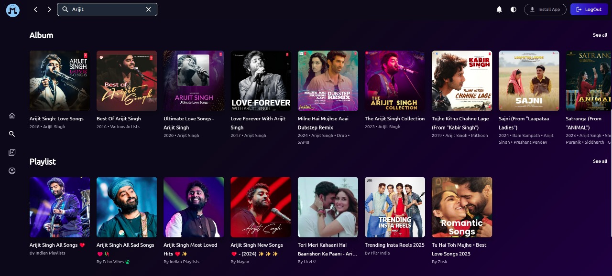
<br>

### 6. Artist Profile

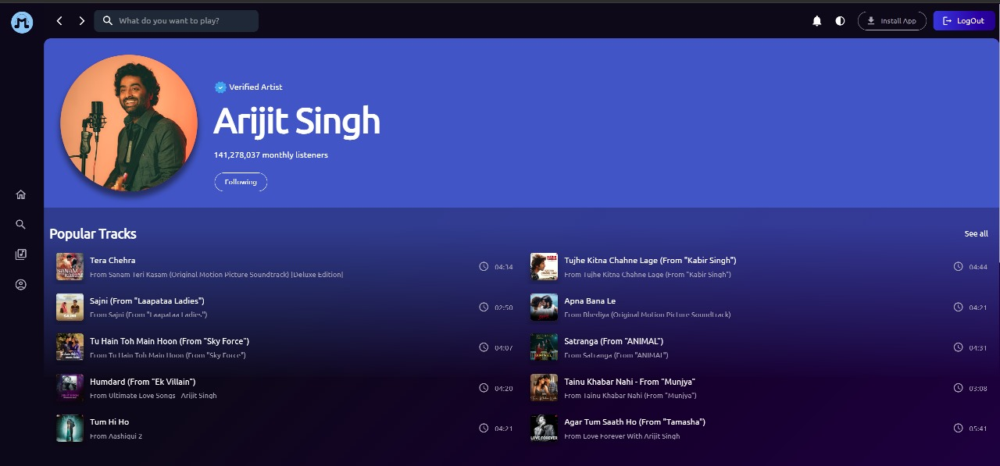
<br>  
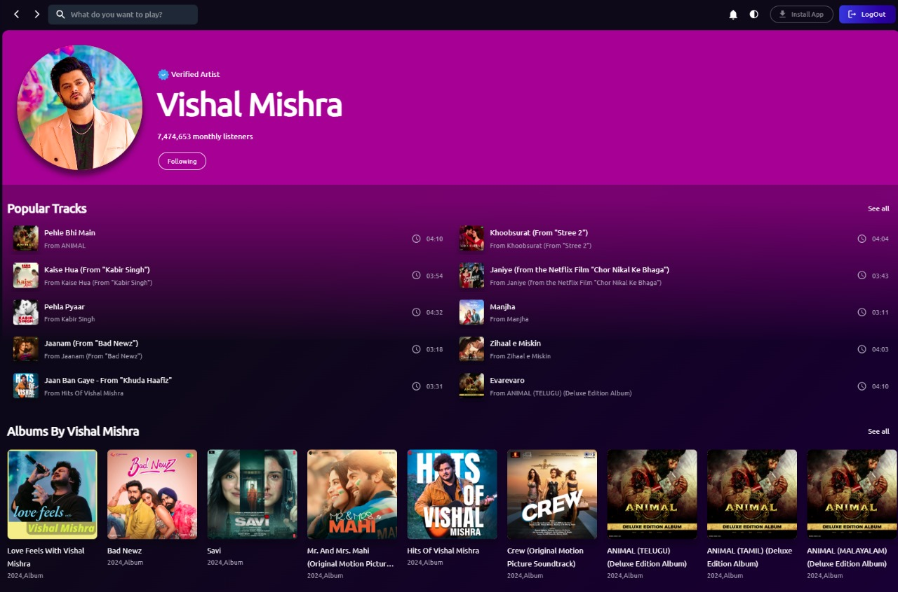
<br>

### 7. Album Details

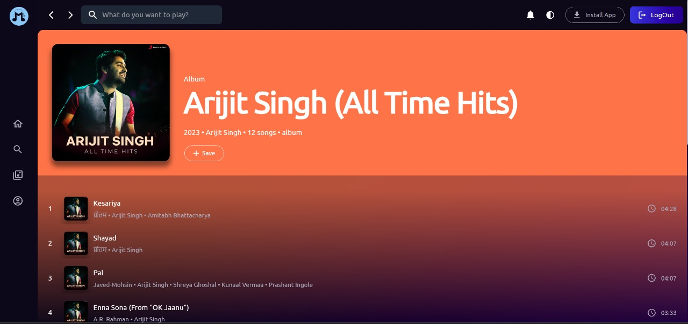
<br>

### 8. Your Library

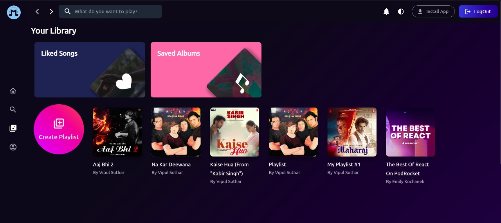
<br>

### 9. Recent Played Tracks

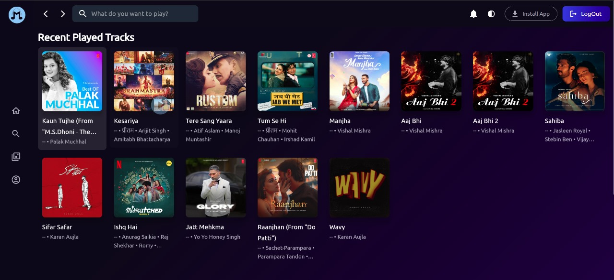
<br>

### 10. Top Tracks and Your Following

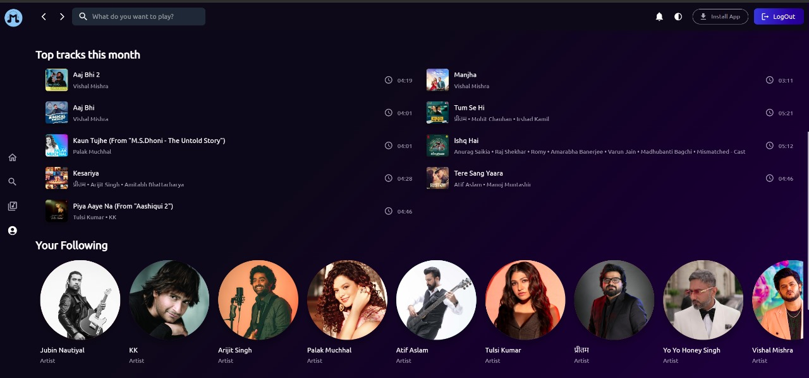
<br>

### 11. One Click Installation

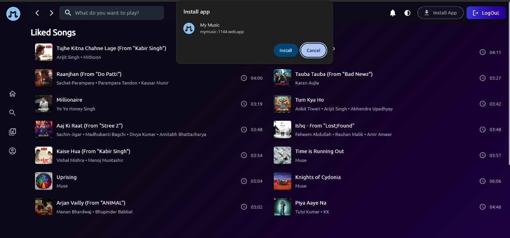
<br>

### 12. Responsive Mobile Layout

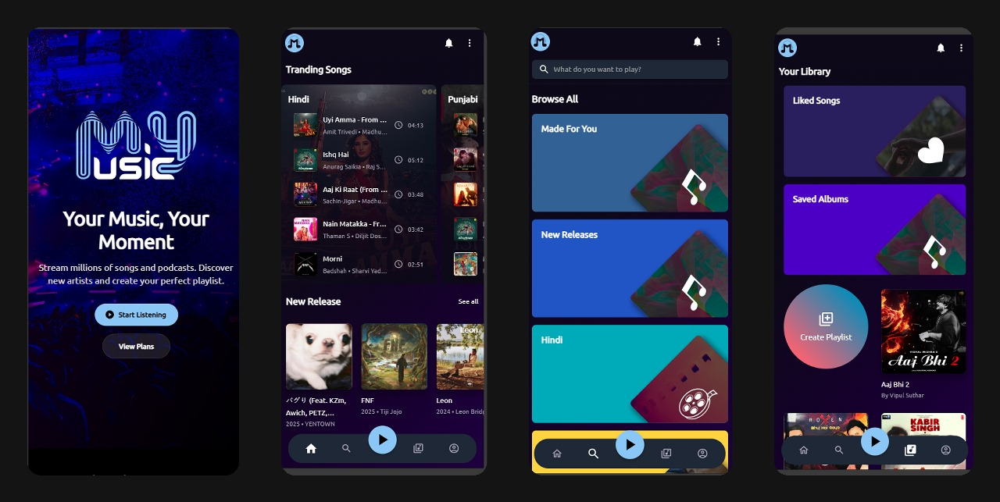
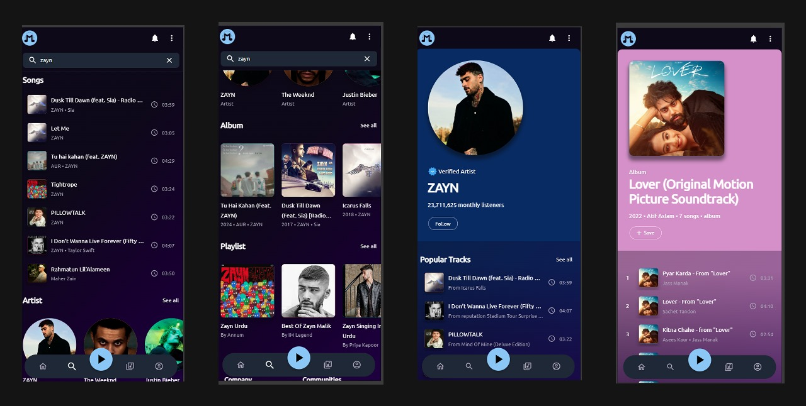
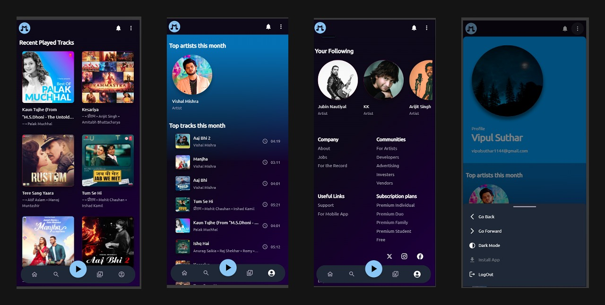
<br>

## **🔧 Installation & Setup**

1️⃣ **Clone the repository**

```sh
git clone https://github.com/vipulsuthar1144/my-music-web.git
cd my-music-web
```

2️⃣ **Install dependencies**

```sh
npm install
```

3️⃣ **Set up environment variables**

Create a `.env` file in the root directory and add:

```
VITE_APP_PORT = 5173
VITE_APP_CLIENT_ID = --------------
VITE_APP_AUTH_API_BASE_ENDPOINT = https://accounts.spotify.com/authorize/
VITE_APP_API_ENDPOINT = https://api.spotify.com/v1/
VITE_APP_REDIRECT_ENDPOINT = http://localhost:5173/callback
```

4️⃣ **Set up Spotify Developer Dashboard**

To enable Spotify authentication, follow these steps:

1. Go to the [Spotify Developer Dashboard](https://developer.spotify.com/dashboard)
2. Click on **Create an App**
3. Enter **App Name**, **Description**, and click **Create**
4. In the app settings, navigate to **Edit Settings**
5. Under **Redirect URIs**, add:
   - `http://localhost:5173/callback`
   - Your production URL if deployed
6. Copy the **Client ID** and paste it into your `.env` file as `VITE_APP_CLIENT_ID`
7. Save changes and restart your development server

5️⃣ **Run the project**

```sh
npm run dev
```

The app will be available at **http://localhost:5173/**

## **🤝 Contributing**

Contributions are **Welcome!** 🎉  
Feel free to **open issues, submit pull requests, or provide feedback** to enhance MyMusic! 🚀

## **📜 License**

This project is **open-source** under the **MIT License**.


## **📬 Let's Connect!**

Got feedback or ideas? Feel free to reach out! 🎶

- 📧 Email: vipulsuthar1144@gmail.com
- 💼 LinkedIn: [Vipul Suthar | LinkedIn](https://www.linkedin.com/in/vipulsuthar1144)
